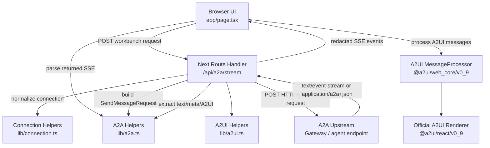
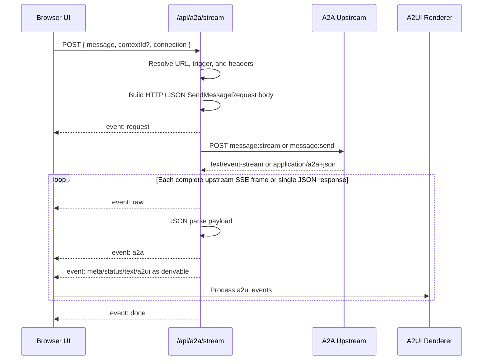

# A2A + A2UI Workbench Design

## Summary

The A2A + A2UI Workbench is a local Next.js App Router application for testing real A2A `message:send` and `message:stream` traffic and rendering A2UI output with the official A2UI React v0.9 renderer.

It is intentionally a protocol workbench, not a production customer console. Its primary jobs are:

- Connect to any HTTP(S) A2A endpoint for a run.
- Send real A2A HTTP+JSON `SendMessageRequest` requests.
- Preserve raw protocol visibility while also rendering user-friendly chat text.
- Extract and normalize A2UI envelopes from A2A parts.
- Render A2UI through `@a2ui/react/v0_9`.
- Keep endpoint credentials server-side for the upstream call and redacted from inspector output.
- Support follow-up turns through returned A2A `contextId`.

The workbench is endpoint-agnostic. Environment values are optional local defaults, and operators can override the upstream URL, A2UI trigger, and headers for each run.

## Current Architecture



### Runtime Boundaries

The browser never calls the A2A endpoint directly. It calls the local Next route at `/api/a2a/stream`.

The route handler runs in the Node.js runtime and performs the upstream A2A request. This is the trust boundary that lets the workbench:

- Merge server-side fallback headers from `.env.local`.
- Forward operator-supplied per-run headers.
- Redact sensitive values before sending request metadata back to the browser inspector.
- Convert arbitrary upstream stream chunks into a stable set of workbench SSE events.

The browser owns user interaction, chat history, the protocol inspector, split-pane layout, A2UI rendering, and client-side abort.

## Request And Stream Flow



### Outbound A2A Request

`lib/a2a.ts` builds an HTTP+JSON SendMessageRequest body with:

- `message.role: "ROLE_USER"`
- Fresh `messageId` UUID.
- A single text part containing the prompt plus the configured A2UI trigger if missing.
- Optional `message.contextId` for follow-up turns.
- `configuration.acceptedOutputModes: ["text/plain"]`.
- `metadata.a2uiClientCapabilities` with the v0.9 basic catalog and inline catalog support.

The route accepts both A2A streaming and non-streaming HTTP+JSON responses. Upstream `message:stream` responses are parsed as SSE. Upstream `message:send` responses are parsed as a single JSON payload and normalized into the same workbench SSE event vocabulary.

### Workbench SSE Events

The route converts upstream stream frames into these browser-facing SSE event names:

| Event | Emitted By | Purpose |
| --- | --- | --- |
| `request` | Route | Redacted outbound request metadata and HTTP+JSON body. |
| `raw` | Route | Original upstream SSE frame or synthetic single-response frame before JSON interpretation. |
| `a2a` | Route | Parsed upstream JSON payload. |
| `meta` | Route | Extracted A2A `id`, `taskId`, `contextId`, `kind`, `final`, and status metadata where present. |
| `status` | Route | Extracted task/status state. |
| `text` | Route | Extracted A2A text parts with fenced A2UI blocks stripped. |
| `a2ui` | Route | Normalized A2UI v0.9 envelope. |
| `error` | Route | Route-level, parse-level, upstream-shape, or transport error. |
| `done` | Route | Local stream completion marker. |

These are workbench events, not A2A standard event names. The raw upstream frame and parsed A2A payload are preserved in the inspector so debugging does not depend on the workbench's normalization choices.

## Connection Model

The connection profile is a per-run object passed from the browser to the route:

```ts
type ConnectionProfileInput = {
  upstream?: unknown;
  a2uiTrigger?: unknown;
  headers?: unknown;
};
```

`lib/connection.ts` normalizes this into:

- A required `http://` or `https://` upstream URL.
- Optional A2UI trigger text.
- Enabled headers with valid HTTP token names.
- Secret classification inferred from header names such as `Authorization`, `apikey`, `token`, or `secret`.

Server-side fallback values come from:

| Variable | Purpose |
| --- | --- |
| `A2A_UPSTREAM` | Default A2A URL when the UI URL is blank. |
| `A2A_API_KEY` | Default secret value sent as `apikey`. |
| `A2A_SCOPE_HEADER` | Optional header name for the default scope value. Defaults to `X-A2A-Scope-User`. |
| `A2A_SCOPE_USER` | Optional default scope value forwarded by the route. |
| `A2A_A2UI_TRIGGER` | Default prompt suffix, usually `[a2ui]`. |

UI-entered connection values take precedence for a run. Server-side default headers and UI headers are merged case-insensitively; later non-empty values override earlier values.

### Persistence Rules

The browser persists connection convenience data to `localStorage`, but secret values are intentionally not saved.

Persisted:

- Upstream URL.
- A2UI trigger.
- Header names.
- Header enabled/secret flags.
- Non-secret header values.

Not persisted:

- Secret header values.
- Stream output.
- Chat history.
- A2A raw events.
- A2UI payloads.

The split-pane percentage is persisted separately in `localStorage`.

## A2A Parsing And Normalization

`lib/a2a.ts` is deliberately small and tolerant. It supports:

- SSE parsing with partial-frame buffering.
- Multi-line SSE `data:` fields.
- Safe JSON parsing.
- Redaction of secret-shaped keys in client-visible payloads.
- A2A payload unwrapping for direct `result` objects, `statusUpdate`, and `artifactUpdate`.
- Part extraction from common A2A shapes:
  - `payload.parts`
  - `payload.status.message.parts`
  - `payload.message.parts`
  - `payload.artifact.parts`
  - `payload.artifacts[].parts`
- Status extraction from `payload.status.state` or fallback `kind`.
- Metadata extraction from task/message/event wrapper fields.

The helpers intentionally do not enforce a full A2A schema. The workbench is a diagnostic surface and should continue streaming when a single frame or envelope is malformed.

## A2UI Extraction And Rendering

A2UI extraction happens in `lib/a2ui.ts`. Supported sources:

- A2A data parts with `mimeType: application/a2ui+json`.
- A2A data parts with `metadata.mimeType: application/a2ui+json`.
- Nested data wrappers that carry `mimeType` and `data`.
- JSON string payloads.
- Legacy fenced text blocks:

````markdown
```a2ui
{ "...": "..." }
```
````

The renderer target is v0.9 because the local official React renderer is available at `../a2ui/renderers/react`. The workbench accepts compatible v0.9 messages directly and downgrades v1.0 basic-catalog envelopes to v0.9 for local rendering.

### Normalization Rules

The A2UI normalizer:

- Flattens arrays and `{ messages: [...] }` wrappers.
- Parses JSON strings recursively.
- Drops unsupported explicit versions such as `v0.8`.
- Adds `version: "v0.9"` when absent or compatible.
- Forces `createSurface.catalogId` to the v0.9 basic catalog.
- Defaults missing `surfaceId` to `investigation`.
- Normalizes `updateDataModel.path` to `/` when missing.
- Copies `updateDataModel.data` into `value` when the renderer expects `value`.
- Inserts a `createSurface` message if the agent only sends updates.
- Inserts a fallback `root` component when no root component exists.

The fallback root behavior is a pragmatic demo safety net. It makes partial A2UI output renderable while still preserving the original normalized envelopes in the inspector.

### Renderer Integration

The page creates one `MessageProcessor<ReactComponentImplementation>` with the v0.9 `basicCatalog`.

Incoming `a2ui` workbench events are processed one at a time. If an incoming envelope creates a surface whose ID already exists, the page deletes the old surface first to avoid stale layouts when a new run reuses the same surface ID.

Rendered surfaces are read from `processor.model.surfacesMap` and displayed with:

```tsx
<A2uiSurface surface={surface} />
```

The page also provides a safe markdown renderer through `MarkdownContext`. It escapes HTML and converts paragraphs/newlines into simple HTML, avoiding arbitrary HTML injection from agent-provided markdown.

## UI Design

The page is a single-screen workbench laid out as:

1. Top status bar.
2. Connection panel.
3. Main resizable Chat + A2UI stage.
4. Protocol Inspector.

The body uses `100dvh` and hidden page overflow. Long content scrolls inside its local region:

- Connection body.
- Chat transcript.
- Prompt textarea.
- A2UI surface stage.
- Timeline and errors lists.
- Protocol inspector JSON.

The main stage uses a draggable and keyboard-accessible separator:

- Pointer drag adjusts the Chat/A2UI split.
- Arrow keys adjust by 5%.
- Home sets 30%.
- End sets 70%.
- Split is clamped between 30% and 70%.

### Chat Behavior

The Chat pane is not the source of truth for protocol data; it is a readable transcript derived from `text` workbench events.

On send:

- If no `contextId` is present, the current A2UI surface is cleared.
- Existing chat is preserved for follow-up turns when `contextId` is present.
- The user prompt is appended immediately.
- The stream is read until completion, abort, or error.

When a `meta` event includes a `contextId`, the context input is updated so the next send can continue the same A2A conversation.

If a failed status is seen and then text arrives, the text is also added to the error list. This makes upstream task failures visible even when the upstream reports them as normal A2A status messages.

### Inspector Tabs

The Protocol Inspector has these tabs:

- `Run`: counters, recent timeline events, errors.
- `Request`: redacted outbound request metadata and body.
- `Raw`: parsed SSE frames from upstream.
- `A2A`: parsed JSON payloads from upstream.
- `A2UI`: normalized envelopes sent to the renderer.
- `Meta`: current context/task/status/client-action summary.

The inspector is designed to prove what happened on the wire, not only what rendered successfully.

## Security And Secret Handling

Security goals for the workbench are demo-grade but explicit:

- Do not expose `.env.local` secrets to the browser.
- Do not persist secret header values in `localStorage`.
- Redact secret-shaped keys from route-emitted SSE data.
- Display outbound request metadata with secret values redacted.
- Allow per-run custom headers without hardcoding credentials.
- Keep all upstream calls on the server route rather than direct browser calls.

Important limitation: if an upstream agent echoes a secret inside ordinary text or a non-secret field name, the workbench cannot reliably detect that semantic leak. The redaction layer is key-name based.

## A2UI Dependency Strategy

The app uses published A2UI packages:

- `@a2ui/react`
- `@a2ui/web_core`

The renderer imports the v0.9 entrypoints:

- `@a2ui/react/v0_9`
- `@a2ui/web_core/v0_9`

## Error Handling

The route emits user-visible `error` events for:

- Missing prompt.
- Missing or invalid A2A URL.
- Blocked private-network, reserved-network, or non-allowlisted upstream URLs.
- Upstream timeout or byte-limit failures.
- Upstream response that is neither `text/event-stream` nor parseable JSON.
- Missing upstream stream body.
- Malformed upstream SSE JSON frames.
- Fetch/transport exceptions.

The browser handles:

- Route `error` events as system chat messages plus inspector errors.
- Local `AbortController` aborts as `aborted` status.
- A2UI renderer exceptions as non-fatal errors in the error list.
- Failed task statuses as sticky failure state so later `done` does not overwrite failure with `complete`.

## Testing Strategy

The current test suite is unit/source focused:

- `src/lib/a2a.test.ts`
  - SSE frame parsing.
  - HTTP+JSON `SendMessageRequest` construction.
  - A2UI trigger insertion.
  - A2A status/message/artifact part extraction.
  - `statusUpdate` unwrapping.
  - Secret redaction.
- `src/lib/a2ui.test.ts`
  - A2UI data-part extraction.
  - Stringified and nested payload support.
  - Fallback surface/root insertion.
  - Version filtering.
  - v1.0-to-v0.9 compatibility normalization.
  - Legacy fenced block extraction and prose stripping.
- `src/lib/connection.test.ts`
  - URL/header normalization.
  - Non-HTTP URL rejection.
  - Header forwarding.
  - Redaction.
  - Non-secret persistence.
- `src/app/page-source.test.ts`
  - Guards against reintroducing premade prompt selections.
  - Keeps run counters in the Protocol Inspector rather than Chat.
- `src/app/api/a2a/stream/route.test.ts`
  - `message:send` JSON response normalization.
  - Private-network upstream blocking.
  - Optional upstream allowlist enforcement.
  - Upstream response byte-limit enforcement.

Standard checks:

```bash
npm run test
npm run typecheck
npm run build
```

## Non-Goals

This workbench does not currently:

- Implement product billing or cost attribution.
- Replace a gateway or endpoint/auth/rate-limit layer.
- Provide a durable conversation store.
- Provide full A2A schema validation.
- Provide full A2UI v1.0 rendering.
- Guarantee semantic secret detection in agent-generated prose.
- Act as the final C2A Console module UX.

## Future Extensions

Likely next design steps:

- Add request-scoped telemetry events for workbench runs without calling them billing records.
- Carry a `requestId` through the browser route, upstream A2A metadata, inspector, and future analytics sink.
- Emit normalized observations such as `a2a.status.updated`, `a2a.artifact.updated`, `a2ui.surface.emitted`, and `stream.completed`.
- Add an optional analytics export path later, fed by normalized request facts rather than UI state.
- Add fixture-driven route tests that mock an upstream SSE endpoint end to end.
- Add browser-level regression tests for nonblank A2UI rendering and no page-level scroll.
- Add a production-console variant that hides raw protocol details by default while keeping the inspector available for developers.
