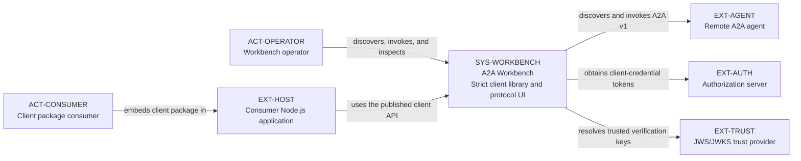
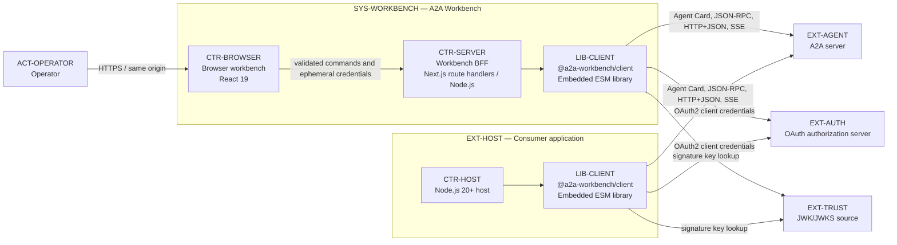
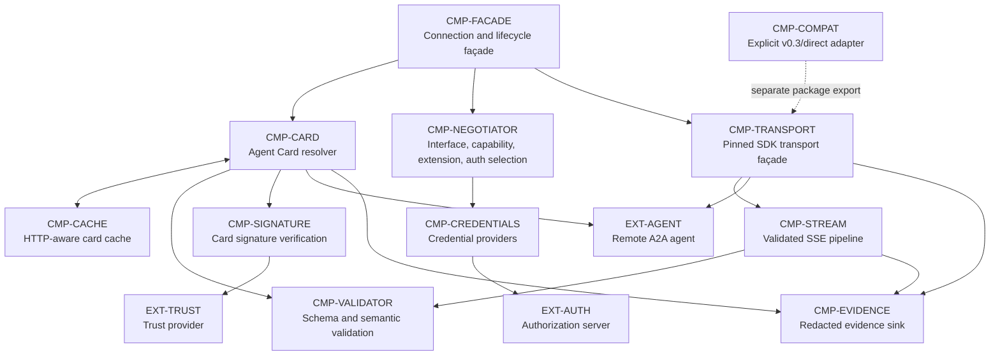
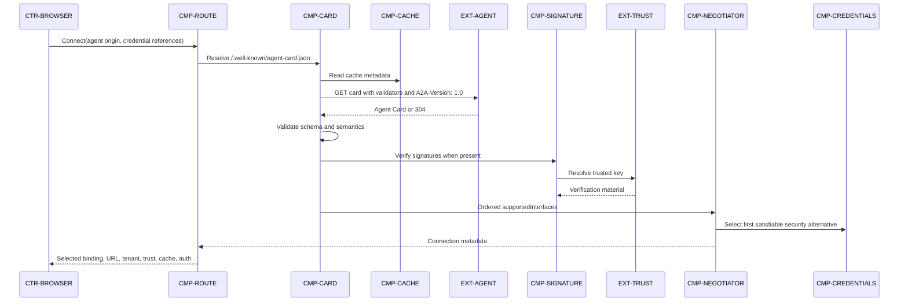
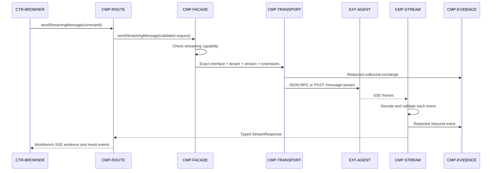
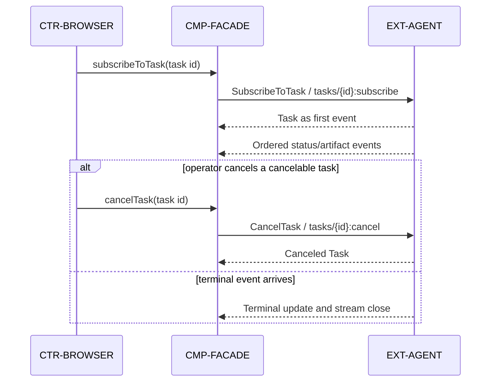
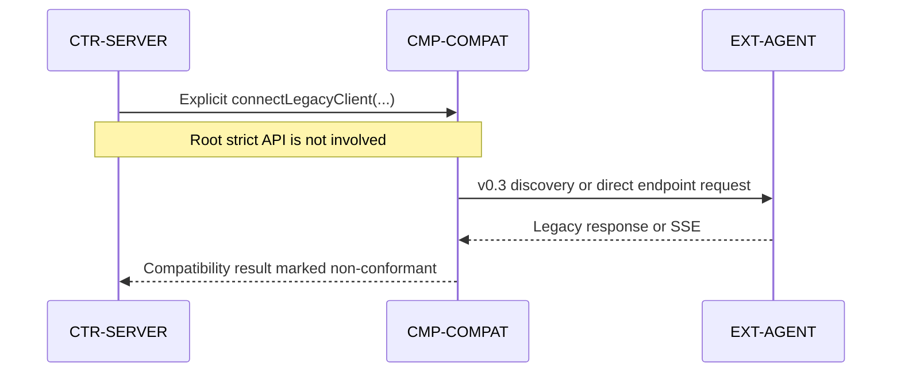
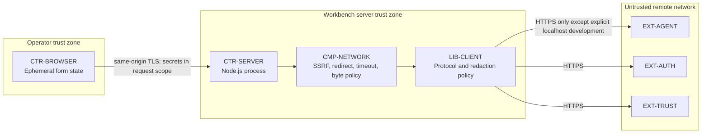

# C4 Model

**Audience:** Maintainers and architecture reviewers  
**Model:** Target architecture only  
**Notation:** Mermaid flowcharts using C4 scopes and stable element identifiers

The published client is a reusable code boundary, not a separately running
service. It is therefore shown inside each Node.js host that embeds it.

## C1: System context

## C2: Runtime containers

## C3: Client package

## Frontend component model

The target browser component model, interaction workspaces, state ownership,
responsive behavior, and accessibility rules are maintained in the separate
[frontend design architecture and C4 model](./frontend-c4-model.md). This system
view retains the `CTR-BROWSER` container boundary without duplicating frontend
component definitions.

## Dynamic view: strict discovery and authentication

## Dynamic view: send streaming message

## Dynamic view: task subscription and cancellation

## Dynamic view: compatibility mode

## Deployment and trust boundaries

## Element catalog

| ID | Kind | Responsibility |
| --- | --- | --- |
| `ACT-OPERATOR` | Person | Exercises agents and inspects protocol evidence. |
| `ACT-CONSUMER` | Person | Embeds the reusable client in another Node.js application. |
| `SYS-WORKBENCH` | Software system | Provides the strict client library and protocol workbench. |
| `CTR-BROWSER` | Container | Captures commands and renders typed results and redacted evidence. |
| `CTR-SERVER` | Container | Applies host policy and adapts the client API to browser SSE. |
| `CTR-HOST` | Container | Represents an external application embedding the client library. |
| `LIB-CLIENT` | Library boundary | Exposes the publication-ready strict and compatibility APIs. |
| `CMP-FACADE` | Component | Owns a connected Agent Card, interface, and lifecycle operations. |
| `CMP-CARD` | Component | Discovers and refreshes Agent Cards. |
| `CMP-CACHE` | Component | Applies HTTP freshness and conditional-request semantics. |
| `CMP-VALIDATOR` | Component | Validates known schema and semantic invariants. |
| `CMP-SIGNATURE` | Component | Verifies at least one trusted signature when signatures exist. |
| `CMP-NEGOTIATOR` | Component | Selects binding, capabilities, extensions, and satisfiable auth. |
| `CMP-CREDENTIALS` | Component | Supplies API-key, HTTP, OAuth2, or explicit custom credentials. |
| `CMP-TRANSPORT` | Component | Wraps the pinned SDK and enforces the selected interface. |
| `CMP-STREAM` | Component | Decodes, validates, orders, and aborts SSE delivery. |
| `CMP-EVIDENCE` | Component | Emits bounded, recursively redacted protocol evidence. |
| `CMP-COMPAT` | Component | Implements explicitly selected v0.3/direct-endpoint behavior. |
| `CMP-ROUTE` | Component | Converts browser commands to public client calls and back to SSE. |
| `CMP-NETWORK` | Component | Enforces SSRF, redirect, timeout, abort, and response-size policy. |
| `EXT-AGENT` | External system | Publishes an Agent Card and serves A2A operations. |
| `EXT-AUTH` | External system | Issues OAuth2 client-credential access tokens. |
| `EXT-TRUST` | External system | Supplies trusted keys for Agent Card signature verification. |
| `EXT-HOST` | External system | Uses the package without depending on the workbench UI. |
