# Frontend Design Architecture and C4 Model

**Status:** Normative target  
**Audience:** Frontend maintainers, protocol designers, accessibility reviewers, and security reviewers  
**Model:** Target architecture only  
**Last reviewed:** 2026-07-16

This document defines the target browser architecture for the A2A Workbench.
It specializes the shared [system C4 model](./c4-model.md) without redefining
its system, container, client-library, or external-system elements. Protocol
semantics and the browser-to-server contract remain governed by the
[protocol contract](./protocol-contract.md).

This document introduces no runtime behavior, browser contract, or public
client API change.

## Design intent

The workbench is a dense developer tool for protocol engineers. It preserves
the existing dark technical identity while reorganizing the experience around
two distinct jobs:

- **Quick Test** provides a low-friction text interaction and readable result.
- **Protocol Lab** is one mode-adaptive structured workspace. Its protocol
  profile dropdown selects strict A2A v1 or direct-endpoint compatibility while
  preserving separate validation, session, and evidence semantics.

The design calibration is:

| Dial | Value | Consequence |
| --- | ---: | --- |
| `DESIGN_VARIANCE` | 4 | Stable pane geometry with limited asymmetry and no decorative layout changes. |
| `MOTION_INTENSITY` | 3 | Interaction feedback and state transitions only. No automatic or scroll-driven motion. |
| `VISUAL_DENSITY` | 8 | Compact controls, persistent context, local scrolling, and monospace protocol data. |

## Goals and quality attributes

| Attribute | Target |
| --- | --- |
| Protocol visibility | Every supported operation, negotiation decision, validation result, and redacted exchange is inspectable. |
| Safety | The browser communicates only with the same-origin BFF and never persists credential values. |
| Mode integrity | Strict and compatibility sessions cannot share a connection, active run, evidence set, or conformance label. |
| Accessibility | Keyboard and assistive-technology users can connect, operate, resize, inspect, abort, and recover without relying on color. |
| Responsiveness | All supported operations remain available from 320px upward without page-level horizontal scrolling. |
| Evolvability | Feature components consume view models and typed workbench events rather than transport-specific wire objects. |
| Performance | Static framing remains server-rendered; interactive client boundaries and the A2UI renderer are kept narrow. |

## Terminology

- **Connection Contract:** The immutable, validated view of the selected
  interface, capabilities, extensions, security, trust, and cache state.
- **Quick Test:** The streamlined connect, send or stream, read, and inspect
  workspace.
- **Protocol Lab:** The structured workspace for manually exercising operations
  supported by the selected protocol profile. Strict mode uses negotiated A2A
  v1; compatibility mode supports direct endpoint traffic and marks evidence
  non-conformant.
- **Run:** One operation from local validation through completion, failure, or
  abort, including its bounded evidence.
- **Session namespace:** Mode-specific connection, draft, result, and evidence
  state that cannot cross the strict and compatibility boundary.
- **View model:** Browser-safe state derived from validated workbench events,
  never directly from an untrusted remote payload.

## Architecture rules

1. The browser never calls an arbitrary agent, authorization server, or trust
   provider directly.
2. The browser depends on the workbench command and event contract, not on
   `@a2a-workbench/client` or its private dependencies.
3. Quick Test and Protocol Lab share session orchestration and validated view
   models, but not presentation-specific state. Protocol Lab has one visible
   protocol profile dropdown rather than separate strict and compatibility
   screens.
4. Strict and compatibility modes use separate session namespaces. Changing
   mode aborts the active run and clears connection-derived state.
5. Controls are enabled from negotiated capabilities. An unavailable control
   remains visible with a reason rather than silently disappearing.
6. Raw evidence remains visible after redaction and validation failure.
7. A2UI is rendered only after strict extension negotiation. It is a result tab,
   not a permanent primary pane.
8. Design tokens and primitives contain no protocol or session logic.
9. Credentials are held only for the active request scope and are never written
   to browser storage, logs, evidence, or rendered diagnostics.

### Protocol Lab profiles

The Protocol Lab profile dropdown changes the command contract, not merely a
display label. The strict profile requires A2A v1 discovery and negotiated
interfaces. The compatibility profile accepts a direct endpoint and permits
structured TextPart, DataPart, RawPart, and UrlPart messages for send and
stream operations. Compatibility traffic remains isolated from strict state and
is always labeled non-conformant in the connection summary and evidence
inspector.

## C1: Frontend system context

The frontend is one interaction surface of the A2A Workbench system. Remote
traffic is mediated by the server-side policy and client boundaries shown in
the shared system model.

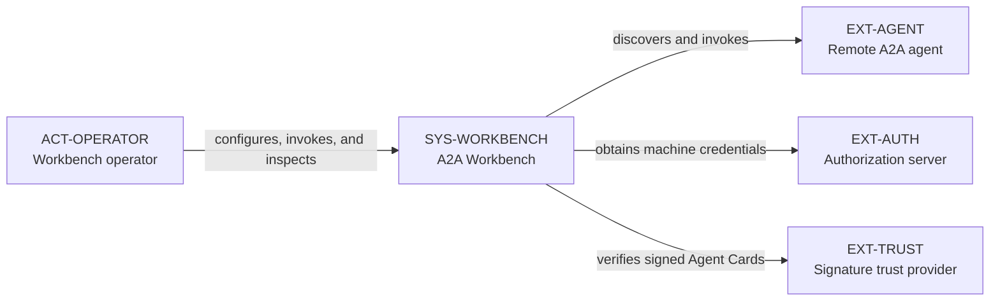

## C2: Frontend execution context

The browser receives server-rendered framing, hydrates focused interactive
components, and sends commands to the same-origin BFF. Only the BFF embeds the
public client library.

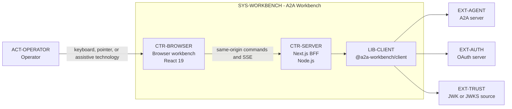

There is no edge from `CTR-BROWSER` to any remote service. This absence is an
architectural constraint, not merely a deployment preference.

## C3: Browser components

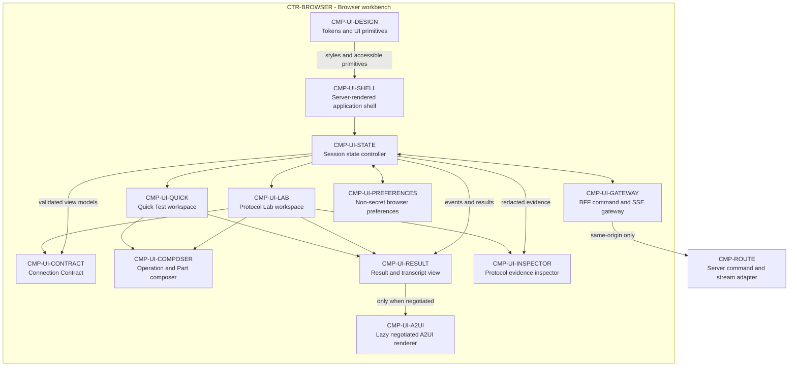

### Component responsibilities

- **Application shell:** Provides the server-rendered landmark structure and
  slots for workspace selection, global run status, and interactive islands.
- **Quick Test:** Optimizes the common connect, send, stream, read, and inspect
  path without hiding the active binding or conformance mode.
- **Protocol Lab:** Composes the connection contract, operation builder, result,
  and evidence zones for complete manual testing. Its visible profile dropdown
  switches between strict A2A v1 and direct-endpoint compatibility behavior.
- **Connection Contract:** Presents interface order, selected binding and URL,
  version, tenant, capabilities, extensions, security alternatives, signature
  status, and cache state.
- **Operation and Part composer:** Builds operation-specific drafts and all four
  v1 Part variants: `text`, `data`, `raw`, and `url`.
- **Result and transcript view:** Shows normalized messages, tasks, artifacts,
  terminal state, and readable text without replacing raw evidence.
- **Protocol evidence inspector:** Presents request, response, SSE, validation,
  correlation, timing, cache, trust, and typed failure evidence.
- **A2UI renderer:** Loads as an isolated client leaf after negotiation and
  disposes all surfaces when the run or session is cleared.
- **Session state controller:** Owns orthogonal mode, connection, draft, run,
  evidence, and selected-view state.
- **BFF gateway:** Encodes browser commands, consumes workbench SSE events,
  propagates abort, and performs no A2A protocol interpretation.
- **Preferences:** Persists only safe layout and form preferences after secret
  fields have been removed.
- **Design layer:** Defines tokens, controls, focus behavior, status treatments,
  pane mechanics, and responsive primitives.

## React and dependency boundaries

The App Router page and static application shell remain Server Components.
Components requiring state, effects, event handlers, browser storage, pane
resizing, or stream consumption are focused Client Components below one session
controller boundary. Marking the route or root layout as a Client Component is
not allowed.

The A2UI dependency is isolated behind `CMP-UI-A2UI` and loaded only after the
connection metadata confirms negotiation. Protocol feature components never
import A2UI packages. The design layer may be imported by any frontend
component, but it cannot import state, route, adapter, or protocol modules.

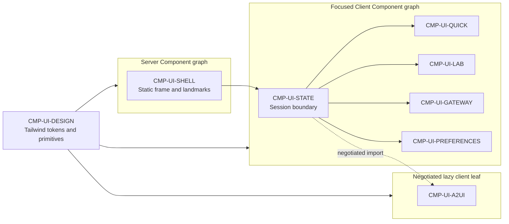

## Dynamic view: connection discovery

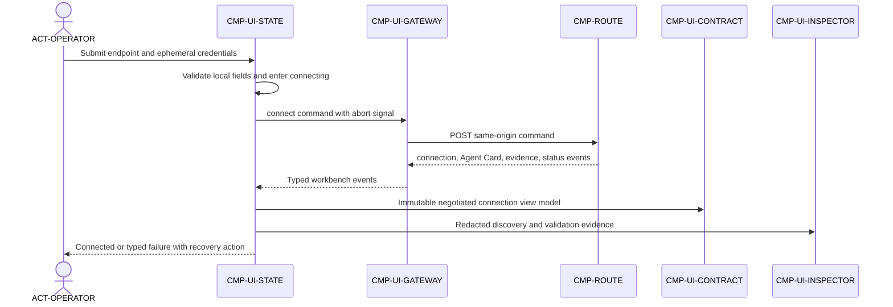

## Dynamic view: streaming fan-out

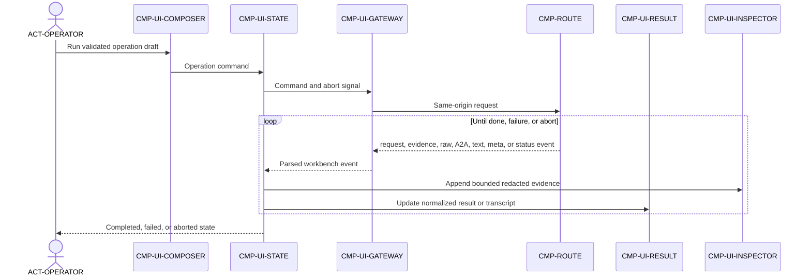

## Dynamic view: negotiated A2UI rendering

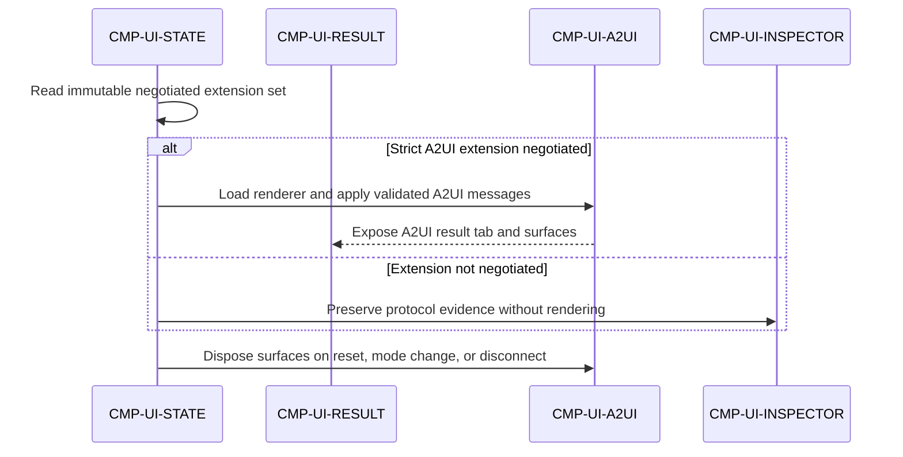

## Dynamic view: strict and compatibility separation

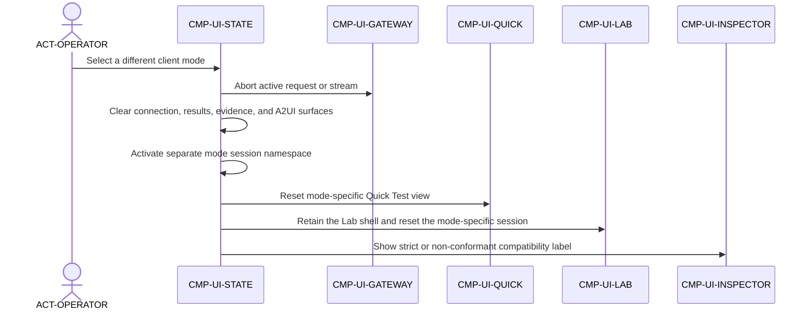

## Dynamic view: server render and command hydration

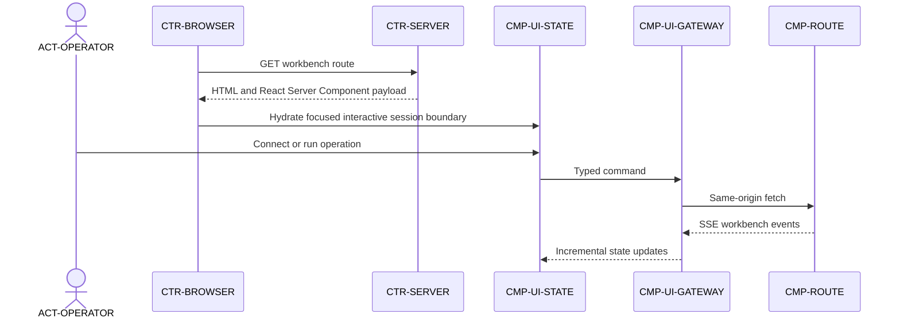

## State model

Connection and execution are separate state machines. This prevents an active
stream from being represented as a connection state and makes invalid control
states explicit.

### Connection state

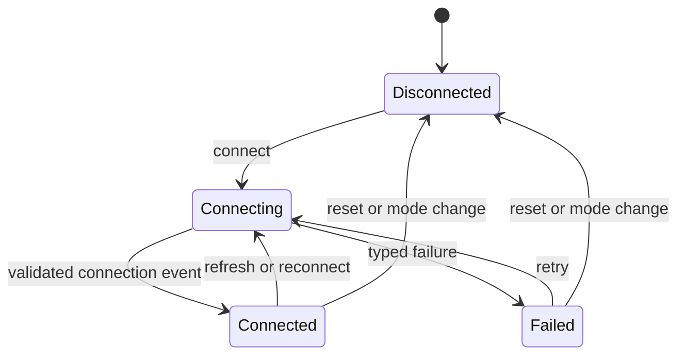

### Run state

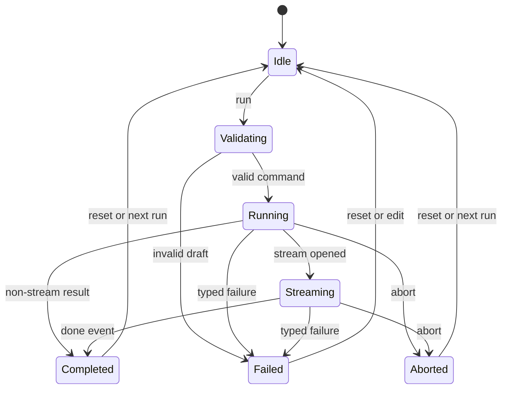

Loading, empty, error, streaming, completed, and aborted states have explicit
presentations. Transient status is announced through a polite live region.
Blocking validation and execution failures receive focus and use text plus an
icon, never color alone.

## Data ownership and persistence

| Data | Browser owner and lifetime |
| --- | --- |
| Workspace, pane sizes, selected inspector tab | Preferences may persist locally without credentials or remote-derived evidence. |
| Endpoint, mode, binding, and A2UI preference | Safe connection preferences may persist locally. |
| Headers and OAuth credentials or configuration | Session controller memory for the active request scope only. |
| Connection metadata | Immutable server-derived snapshot for one connection. Cleared on reconnect, reset, or mode change. |
| Operation drafts | Workspace-local browser state. Draft persistence must exclude raw secret headers. |
| Results and evidence | Bounded current-run state. Raw evidence remains redacted and is cleared with the session. |
| A2UI surfaces | Ephemeral renderer state disposed on reset, disconnect, mode change, or component unmount. |

The browser cannot treat local state as authoritative for Agent Cards, Tasks,
Messages, Artifacts, capabilities, trust, cache, authentication, or protocol
validity. Those values originate from validated server events.

## Layout and responsive behavior

| Viewport | Target layout |
| --- | --- |
| 1280px and wider | Protocol Lab displays Connection Contract, Operation Builder with Result, and Evidence Inspector as three resizable zones. |
| 768px to 1279px | Operation and Result remain primary. Connection Contract uses a drawer and Evidence Inspector uses a secondary pane or lower tab region. |
| 320px to 767px | One workspace pane is visible at a time through Compose, Result, and Inspect tabs. Run and abort controls remain reachable without horizontal scrolling. |

Quick Test uses a simpler composition at every width: connection summary,
transcript, prompt, run controls, and optional inspector. Protocol Lab retains all
operations supported by the selected protocol profile on small screens rather than becoming read-only. Pane
resizers are keyboard operable on desktop and are removed when the layout
collapses.

## Visual system

- Tailwind v4 remains the styling foundation. No second component or design
  system is introduced.
- The page uses a fixed dark theme with `#06080d` as the base surface and
  `#f6fbff` as the primary foreground.
- Cyan `#11f0f0` is the only interactive accent. Additional colors are reserved
  for protocol categories and semantic success, warning, or failure states.
- Inter remains the interface typeface through `next/font`. Protocol values,
  identifiers, headers, timing, and JSON use the existing monospace stack.
- Panels, inputs, buttons, and tabs use an 8px radius. Fully rounded shapes are
  limited to compact status indicators with semantic meaning.
- Controls use a 40px default minimum target. Dense inspector controls may use
  32px when an equivalent keyboard path and visible focus are present.
- Motion is limited to 160ms transform, opacity, border, and background feedback.
  Reduced-motion preferences collapse transitions to immediate state changes.
- Lucide remains the sole icon family for this preservation release. Icons
  supplement labels and never replace essential control text without an
  accessible name.

## Accessibility requirements

- Meet WCAG 2.2 AA for text, controls, focus indicators, and semantic status
  colors.
- Preserve logical landmark, heading, tab, form, and focus order at every
  breakpoint.
- Associate every input with a visible label. Helper and error text remain
  programmatically connected to the field.
- Support complete operation, tab, drawer, disclosure, pane-resize, run, and
  abort workflows by keyboard.
- Use `aria-live="polite"` for run progress and focused alerts for blocking
  errors. High-volume SSE events are not individually announced.
- Keep raw JSON and protocol payloads selectable, locally scrollable, and
  readable at 200 percent zoom.
- Respect reduced motion and avoid automatic animation, parallax, scroll
  interception, and continuously moving status decoration.

## Failure and recovery model

Typed workbench failures retain their protocol, authentication, validation,
transport, and policy categories. The UI presents a safe summary, error code,
operation, retryability, and a recovery action when one exists. Redacted details
remain available in the inspector.

Local draft errors do not reach the BFF. Connection failures preserve safe form
inputs for correction. Run failures preserve the operation draft and completed
evidence. Abort is a distinct outcome, not an error. Unsupported capabilities,
transports, and authentication methods remain visible with an explanation and
cannot be invoked.

## Element catalog

Shared elements such as `ACT-OPERATOR`, `SYS-WORKBENCH`, `CTR-BROWSER`,
`CTR-SERVER`, `LIB-CLIENT`, `CMP-ROUTE`, and external systems are defined in the
[system C4 element catalog](./c4-model.md#element-catalog).

| ID | Kind | Responsibility |
| --- | --- | --- |
| `CMP-UI-SHELL` | Component | Provides the server-rendered application frame, landmarks, workspace entry, and global status slots. |
| `CMP-UI-STATE` | Component | Coordinates mode, connection, draft, run, evidence, result, abort, and selected-view state. |
| `CMP-UI-QUICK` | Component | Presents the simple connect, send or stream, read, and inspect workflow. |
| `CMP-UI-LAB` | Component | Composes the full manual protocol-testing workspace. |
| `CMP-UI-CONTRACT` | Component | Presents the validated and negotiated connection contract. |
| `CMP-UI-COMPOSER` | Component | Builds capability-aware operation requests and structured message Parts. |
| `CMP-UI-RESULT` | Component | Displays normalized protocol results, task state, artifacts, and readable transcript content. |
| `CMP-UI-INSPECTOR` | Component | Displays binding-aware, redacted request, response, SSE, validation, and failure evidence. |
| `CMP-UI-A2UI` | Component | Lazily renders and disposes A2UI surfaces after strict extension negotiation. |
| `CMP-UI-GATEWAY` | Component | Sends same-origin commands, parses workbench SSE events, and propagates abort. |
| `CMP-UI-PREFERENCES` | Component | Persists only approved non-secret browser preferences. |
| `CMP-UI-DESIGN` | Component | Defines visual tokens, primitives, responsive layout, focus, and interaction behavior. |

## Related architecture

- [Architecture hub](./README.md)
- [System C4 model](./c4-model.md)
- [Protocol contract](./protocol-contract.md)
- [Strict and compatibility boundary](./decisions/0001-strict-compatibility-boundary.md)
- [Reusable client package](./decisions/0002-reusable-client-package.md)
