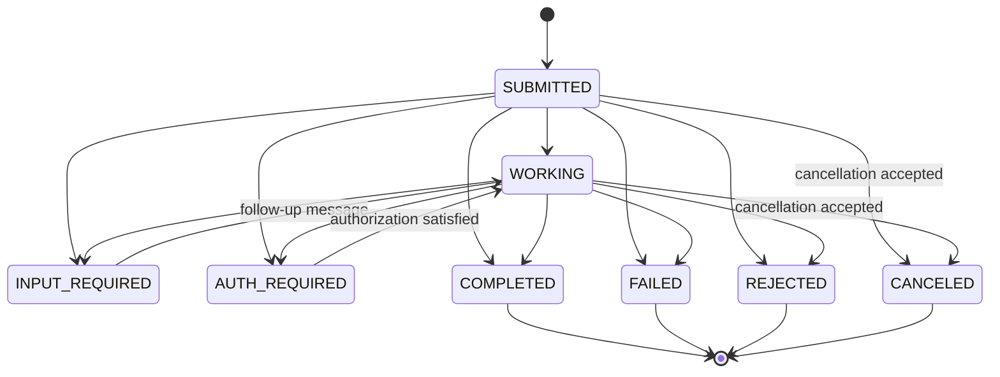

# Protocol and Public API Contract

**Audience:** Package consumers and protocol implementers  
**Applies to:** `@a2a-workbench/client` v0.1.x strict API

## Public package boundary

The root export is strict A2A v1. Compatibility behavior is available only from
`@a2a-workbench/client/compat`.

```ts
const client = await connectA2aClient({
  agentUrl: "https://agent.example.com",
  requestedExtensions: ["https://a2ui.org/a2a-extension/a2ui/v0.9"],
  credentialProvider,
  evidenceSink,
});

for await (const event of client.sendStreamingMessage(request)) {
  render(event);
}
```

The strict entry point exposes:

```ts
connectA2aClient(options: StrictClientOptions): Promise<A2aClient>

A2aClient.getAgentCard(): AgentCard
A2aClient.refreshAgentCard(options?: RequestOptions): Promise<AgentCard>
A2aClient.getExtendedAgentCard(options?: RequestOptions): Promise<AgentCard>
A2aClient.sendMessage(request: SendMessageRequest, options?: RequestOptions): Promise<SendMessageResult>
A2aClient.sendStreamingMessage(request: SendMessageRequest, options?: RequestOptions): AsyncIterable<StreamResponse>
A2aClient.getTask(request: GetTaskRequest, options?: RequestOptions): Promise<Task>
A2aClient.listTasks(request: ListTasksRequest, options?: RequestOptions): Promise<ListTasksResponse>
A2aClient.cancelTask(request: CancelTaskRequest, options?: RequestOptions): Promise<Task>
A2aClient.subscribeToTask(request: SubscribeToTaskRequest, options?: RequestOptions): AsyncIterable<StreamResponse>
```

All exported values are typed with readonly properties where mutation is not part
of the contract. `StrictClientOptions` accepts injected `fetch`, `clock`,
`AgentCardCache`, `CredentialProvider`, `SignatureTrustStore`, `UrlPolicy`, and
`EvidenceSink` implementations.

## Connection state

A successful connection is immutable and contains:

- The validated public Agent Card and its discovery URL.
- The exact selected `AgentInterface` and binding.
- Protocol version `1.0` and the selected tenant, if declared.
- Requested extensions that the Agent Card declared.
- The selected, satisfiable security requirement.
- Agent Card freshness, validator, and signature-verification metadata.

Refreshing the Agent Card either produces a new connection snapshot compatible
with v1 or fails. It never converts a strict connection into compatibility mode.

## Discovery and interface selection

1. Resolve the supplied origin at `/.well-known/agent-card.json`, or fetch an
   explicitly supplied Agent Card URL.
2. Apply host URL policy before the request and after every redirect.
3. Send `A2A-Version: 1.0` and conditional cache headers when available.
4. Validate the response before caching or selection.
5. If signatures are present, verify at least one signature with a trusted key.
6. Walk `supportedInterfaces` in declaration order and select the first v1
   `JSONRPC` or `HTTP+JSON` entry.
7. Use the selected URL exactly and propagate its tenant on every operation.
8. Fail with `UNSUPPORTED_TRANSPORT` when no entry is usable.

HTTP caching honors `Cache-Control`, `Age`, `Expires`, `ETag`, and `Last-Modified`.
A `304` refreshes stored freshness metadata without replacing the validated card.
`no-store` prevents persistence and `no-cache` requires revalidation.

## Operations and binding equivalence

| Operation | JSON-RPC method | HTTP+JSON |
| --- | --- | --- |
| Send message | `SendMessage` | `POST /message:send` |
| Send streaming message | `SendStreamingMessage` | `POST /message:stream` |
| Get task | `GetTask` | `GET /tasks/{id}` |
| List tasks | `ListTasks` | `GET /tasks` |
| Cancel task | `CancelTask` | `POST /tasks/{id}:cancel` |
| Subscribe to task | `SubscribeToTask` | `POST /tasks/{id}:subscribe` |
| Extended Agent Card | `GetExtendedAgentCard` | `GET /extendedAgentCard` |

Every operation sends `A2A-Version: 1.0`. Negotiated extension URIs are serialized
in `A2A-Extensions`. Tenant is transmitted through the binding exactly as declared
by the selected interface. JSON-RPC responses must match the request identifier.

Streaming capability is required before send-stream and subscribe operations.
Each SSE data payload is decoded and validated independently. Subscribe requires a
Task as its first event and ends at a terminal task state or abort signal.

## Domain model

The validator covers Agent Cards, interfaces, security schemes, Messages, Parts,
Artifacts, Tasks, TaskStatus, SendMessageResult, ListTasksResponse, streaming
events, JSON-RPC envelopes, and problem/error responses.

Task states are modeled as a closed known-state union plus an unknown forward-
compatible value. Known terminal states are `COMPLETED`, `FAILED`, `CANCELED`, and
`REJECTED`. `INPUT_REQUIRED` and `AUTH_REQUIRED` are resumable nonterminal states.

A `Part` must contain exactly one content representation: text, raw bytes, URL, or
structured data. Known fields are validated while unknown fields remain available
in raw, redacted evidence.

### Task state interpretation

The client accepts server-owned task transitions and does not synthesize states.
The diagram shows common paths, not a client-enforced transition whitelist:



Unknown future states remain visible. A send or subscription stream ends when a
known terminal state is received; clients resume interrupted tasks by sending a
follow-up message, subscribing, or polling rather than mutating local state.

## Data ownership and dependencies

| Data or dependency | Owner and rule |
| --- | --- |
| Agent Cards, Tasks, Messages, Artifacts | The remote agent is authoritative; the client stores only validated snapshots. |
| Agent Card cache | The embedding host owns storage; the client owns cache semantics and never stores credentials with cards. |
| Credentials and trust keys | The embedding host owns acquisition, rotation, and revocation; the client requests them just in time. |
| Connection metadata | The client owns an immutable snapshot derived from one validated Agent Card and selected interface. |
| Raw evidence | The client creates bounded, redacted events; the host chooses retention. The browser keeps only the current run. |
| `@a2a-js/sdk` and Ajv | Private implementation dependencies behind the package façade; consumers do not receive SDK domain types. |
| Workbench UI and route | Depend only on public client exports. The client package never imports React, Next.js, or workbench modules. |
| Compatibility adapter | May depend on the transport façade but cannot be imported by or selected from the strict root API. |

## Deployment assumptions

- The package runs inside a trusted Node.js 20+ host with Web Fetch, Web Crypto,
  streams, and abort support.
- The browser never contacts arbitrary A2A agents directly; the workbench BFF is
  the credential, SSRF, redirect, timeout, and response-limit boundary.
- Production agent, OAuth, and trust endpoints use HTTPS. Plain HTTP is limited
  to explicitly enabled loopback/private development fixtures.
- Agent Card caches are process-local by default. Multi-instance hosts inject a
  cache implementation with their required consistency and eviction behavior.
- Evidence persistence, application authentication, rate limits, and tenant
  authorization remain host responsibilities.

## Authentication

Agent Card security requirements use OpenAPI semantics: the array is OR, while all
schemes named by one object are AND. The client selects the first fully satisfiable
alternative.

Supported credentials are:

- Header API keys
- HTTP Basic
- HTTP Bearer
- OAuth2 client credentials using `client_secret_basic` or `client_secret_post`
- Explicit custom headers supplied by a host `CredentialProvider`

Interactive OAuth, OpenID Connect, device code, and mutual TLS return
`UNSUPPORTED_AUTHENTICATION`. Tokens are acquired only from the declared or
explicitly configured HTTPS token endpoint and are scoped to the call lifecycle.

## Signature trust

Unsigned Agent Cards are accepted and reported as `unsigned`. A signed Agent Card
is accepted only when at least one signature validates against the configured
trust store. Signed cards with no trust store, no matching key, invalid protected
headers, or failed verification return `SIGNATURE_VERIFICATION_FAILED`.

Verification excludes the `signatures` field from the canonical payload and uses
the JWS rules defined by the v1 specification. Trust resolution is injectable so a
host may use pinned JWKs or an allowlisted JWKS resolver.

## Failure taxonomy

`A2aClientError` includes a stable code, operation, retryability, safe message,
optional HTTP/protocol status, and redacted cause details.

| Code family | Examples |
| --- | --- |
| Discovery | `DISCOVERY_FAILED`, `AGENT_CARD_INVALID`, `CACHE_REVALIDATION_FAILED` |
| Negotiation | `UNSUPPORTED_TRANSPORT`, `UNSUPPORTED_CAPABILITY`, `UNSUPPORTED_EXTENSION` |
| Trust/auth | `SIGNATURE_VERIFICATION_FAILED`, `UNSUPPORTED_AUTHENTICATION`, `AUTHENTICATION_FAILED` |
| Protocol | `VERSION_NOT_SUPPORTED`, `PROTOCOL_VIOLATION`, `RESPONSE_ID_MISMATCH`, `STREAM_INVALID` |
| Remote task | `TASK_NOT_FOUND`, `TASK_NOT_CANCELABLE`, `REMOTE_A2A_ERROR` |
| Host/network | `URL_POLICY_REJECTED`, `NETWORK_ERROR`, `TIMEOUT`, `RESPONSE_TOO_LARGE`, `ABORTED` |

Unknown failures are wrapped as `A2aClientError`; raw credentials and token
responses never appear in messages, evidence, or cause details.

## Evidence and observability

Evidence events are discriminated by `decision`, `request`, `response`, `stream`,
or `error`. Each contains an ID, timestamp, operation, binding, selected URL, and
redacted details. Bodies and headers are size bounded. Secret-shaped keys and
authorization, cookie, API-key, and credential headers are recursively redacted.

The workbench maps evidence directly into its inspector. It may add UI timing and
route metadata, but it does not reinterpret raw payloads as conformant data.

## Host security policy

Strict protocol policy requires HTTPS except for explicitly allowed loopback
development. The workbench host additionally:

- rejects private, link-local, multicast, unspecified, and metadata-service
  targets unless local testing is explicitly enabled;
- allowlists hosts when configured;
- re-resolves and revalidates every redirect target;
- limits redirect count, request duration, and response bytes;
- propagates abort signals through discovery, OAuth, and operations; and
- keeps secrets out of persistence and logs.

## Extensions and A2UI

An extension is active only when its URI appears in the Agent Card and in
`requestedExtensions`. Active URIs are sent in `A2A-Extensions`. Strict A2UI
rendering requires negotiation of the supported A2UI extension URI and an
`application/a2ui+json` Part. Text triggers and fenced-payload extraction are
compatibility behavior.

## Conformance reporting

`conformance/client-requirements.json` records the specification and TCK revisions,
supported bindings/features, and requirement-to-component/test mappings. CI rejects
applicable `MUST` entries without an architecture owner or test.

Reports use the label **A2A v1 client conformance — spec/TCK-derived**. The A2A TCK
executes against servers, so its successful scenarios inform client tests but do
not certify this client.
